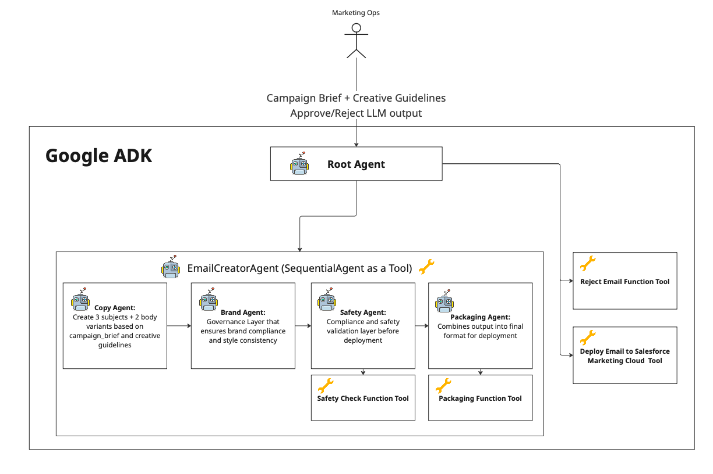
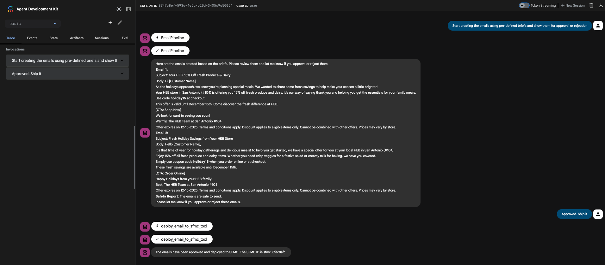
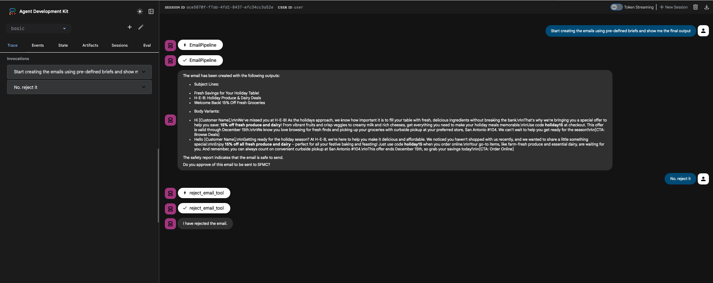

# Marketing Email Generator

This sample demonstrates the use of Agent Development Kit to deliver an automated email generation system for marketers. A multi-agent system orchestrates the creation of personalized, on-brand, and compliant email campaigns from structured campaign briefs, ensuring brand governance and safety compliance throughout the generation process.

This example includes illustrations with ADK supported features such as sequential agent workflows, function tools for brand and safety checks, session state management, and integration with email service platforms.

## Problem Statement

Marketing teams face significant challenges in creating effective email campaigns at scale:

*   **Manual Content Creation**: Writing personalized email variants is time-consuming and requires creative expertise
*   **Brand Consistency**: Ensuring all email content adheres to brand guidelines, tone, and style rules across multiple campaigns
*   **Compliance Risk**: Manual review processes are error-prone, risking spam triggers, PII exposure, and policy violations that can damage deliverability
*   **Scalability**: Creating A/B test variants and personalized content for different segments requires significant human resources
*   **Quality Control**: Maintaining consistent quality while generating multiple subject lines and body variants is challenging

Traditional email marketing tools require marketers to manually craft content, apply brand rules, and perform compliance checks—a process that doesn't scale and introduces human error.

## Solution

The Marketing Email Generator leverages Google's Agent Development Kit (ADK) to automate the entire email generation workflow through a **multi-agent system**. Each agent specializes in a specific aspect of email creation:

1. **Content Generation** - AI agents create multiple subject line and body variants based on campaign briefs
2. **Brand Governance** - Automated agents enforce brand rules, tone guidelines, and style constraints
3. **Safety Compliance** - Specialized agents perform automated compliance checks for spam, PII, and policy violations
4. **Human-in-the-Loop Approval** - The root agent orchestrates a critical approval workflow where marketers review the generated email content (governed email and safety report) before deployment. This human-in-the-loop pattern ensures:
   - **Quality Control**: Marketers can review and validate AI-generated content before it reaches customers
   - **Brand Alignment**: Human judgment ensures the final output matches brand expectations beyond automated checks
   - **Risk Management**: Final approval gate prevents deployment of potentially problematic content
   - **Flexibility**: Marketers can approve, reject, or request modifications, with the system handling each decision appropriately (deployment via `deploy_email_to_sfmc_tool` or rejection via `reject_email_tool`)

**Why Agents?** Agents are central to this solution because:
*   **Specialization**: Each agent has a focused responsibility (copywriting, brand governance, safety), enabling better quality and maintainability
*   **Sequential Workflow**: Agents work together in a pipeline, where each stage builds on the previous one, ensuring proper data flow and validation
*   **Tool Integration**: Agents can leverage function tools for deterministic operations (brand checks, safety validation) while using LLMs for creative tasks
*   **State Management**: Agents share context through session state, enabling complex multi-step workflows
*   **Extensibility**: New agents can be added to the pipeline (e.g., personalization agent, analytics agent) without disrupting existing functionality

## Value Proposition

This solution delivers significant value to marketing organizations:

*   **Time Savings**: Reduces email creation time from hours to minutes by automating content generation and governance
*   **Consistency**: Ensures 100% adherence to brand guidelines through automated enforcement
*   **Risk Mitigation**: Prevents compliance violations before deployment, protecting brand reputation and deliverability
*   **Scalability**: Enables creation of multiple campaign variants simultaneously without proportional increase in resources
*   **Quality**: Combines AI creativity with deterministic rule enforcement for high-quality, compliant outputs

## Overview

The email generation workflow is divided into distinct stages: content creation, brand governance, safety compliance, and deployment. Each stage involves specialized agents working together to transform a campaign brief into ESP-ready email content.

During the content creation stage, the `CopyAgent` generates multiple subject line and body variants based on the campaign brief and creative guidelines. The `BrandAgent` then applies brand rules and style guidelines to ensure consistency. The `SafetyAgent` performs compliance checks for spam triggers, PII detection, and policy violations. Finally, the `PackagingAgent` assembles the final output (governed email and safety report) into a structured JSON payload.

**Human-in-the-Loop Approval**: The root agent then presents this packaged output to the marketer for review. The marketer can examine the generated email content, review the safety compliance report, and make an informed decision. Upon approval, the system deploys the email to the email service platform (e.g., Salesforce Marketing Cloud) via the `deploy_email_to_sfmc_tool`. If rejected, the `reject_email_tool` handles the rejection appropriately. This approval checkpoint ensures human oversight and maintains quality control before any email reaches customers.

## Key Concepts Demonstrated

This implementation demonstrates the following key ADK concepts:

1. **Multi-Agent Systems**: A sequential agent pipeline (`SequentialAgent`) coordinates specialized agents (Copy, Brand, Safety, Packaging) to accomplish a complex task
2. **Function Tools**: Deterministic operations (brand checking, safety validation, SFMC deployment) are implemented as function tools that agents can invoke
3. **Session State & Memory**: Agents share context through ADK's session state, enabling data flow between sequential stages and maintaining campaign briefs, creative guidelines, and intermediate outputs
4. **Agent-to-Agent Communication**: Outputs from one agent (e.g., `draft_email` from CopyAgent) are automatically passed to subsequent agents (BrandAgent) via state keys
5. **Human-in-the-Loop**: The root agent presents results for human approval, demonstrating integration of human decision-making in automated workflows
6. **Retry Logic & Error Handling**: Configurable HTTP retry options with exponential backoff ensure robust API interactions

## Agent Details

The key features of the Marketing Email Generator include:

| Feature | Description |
| --- | --- |
| **Interaction Type:** | Conversational |
| **Complexity:**  | Advanced |
| **Agent Type:**  | Multi Agent |
| **Components:**  | Tools, AgentTools, Memory |
| **Vertical:**  | Marketing Automation |

### Agent Architecture

The system architecture follows a sequential pipeline pattern, where specialized agents process email content through distinct stages:



**Architecture Flow:**

1. **Root Agent** (`basic/agent.py`)
   - Orchestrates the entire workflow
   - Invokes the `initial_email_creator_agent` (SequentialAgent) to generate email content
   - **Human-in-the-Loop Approval**: After the pipeline completes, the root agent presents the generated content (governed_email + safety_report) to the marketer for review
   - **Decision Handling**: Based on human feedback:
     - **Approval**: Calls `deploy_email_to_sfmc_tool` to deploy the email to Salesforce Marketing Cloud
     - **Rejection**: Calls `reject_email_tool` to handle the rejection and log the decision
   - This approval checkpoint ensures human oversight before any email is sent to customers

2. **Email Pipeline (SequentialAgent)** (`basic/sub_agents.py`)
   - Coordinates the multi-stage email generation process
   - Executes agents sequentially with automatic state passing:
     - **Copy Agent**: Reads `campaign_brief` and `creative_guidelines` from state → Generates 3 subject lines and 2 body variants → Outputs to `draft_email` state key
     - **Brand Agent**: Reads `draft_email` and `creative_guidelines` → Applies brand rules (filters banned phrases, enforces length limits, appends disclaimers) → Outputs to `governed_email` state key
     - **Safety Agent**: Reads `governed_email` → Calls `safety_check_tool` to validate compliance → Outputs to `safety_report` state key
     - **Packaging Agent**: Reads `governed_email` and `safety_report` → Combines into final JSON structure

**State Management:**
- Initial state is loaded via `_load_precreated_brief` callback before pipeline execution
- Each agent's output becomes available to subsequent agents through session state keys
- State keys: `campaign_brief`, `creative_guidelines`, `draft_email`, `governed_email`, `safety_report`

### Component Details

*   **Agents:**

    * `root_agent` - The main orchestrator that implements the human-in-the-loop approval workflow:
      - Executes the email creation pipeline via `initial_email_creator_agent`
      - Presents the generated email content (`governed_email`) and safety validation results (`safety_report`) to the marketer
      - Waits for human approval decision
      - If approved: invokes `deploy_email_to_sfmc_tool` to send the email to Salesforce Marketing Cloud
      - If rejected: invokes `reject_email_tool` to handle the rejection appropriately
      - This ensures all generated emails are reviewed by a human before deployment, maintaining quality control and brand safety

    * `initial_email_creator_agent` (SequentialAgent) - Coordinates the sequential execution of copy, brand, safety, and packaging agents to produce a complete email campaign.

    * `copy_agent` - Generates email content variants (3 subject lines and 2 body variants) following the campaign brief and creative guidelines, outputting structured JSON.

    * `brand_agent` - Applies brand governance rules including tone enforcement, banned phrase filtering, length limits, and disclaimer appending to ensure brand consistency.

    * `safety_agent` - Performs compliance checks by calling the safety_check tool to detect spam triggers, PII, and policy violations.

    * `packaging_agent` - Assembles the final output by combining the governed email and safety report into a structured JSON payload ready for review or deployment.

*   **Tools:**

    * `safety_check_tool` - A function tool that performs naive spam and PII detection heuristics on the governed email content, returning a safety report with pass/fail status and detected issues.

    * `deploy_email_to_sfmc_tool` - A function tool that mocks the deployment of email content to Salesforce Marketing Cloud, returning a confirmation with SFMC ID and status.

    * `reject_email_tool` - A function tool that handles email rejection when the marketer disapproves the generated content.

*   **Memory:** 

    * The system uses ADK's internal session state as memory to store campaign briefs, creative guidelines, intermediate agent outputs (draft_email, governed_email, safety_report), and final packaged results.

    * The `_load_precreated_brief` callback function loads initial state from `data/initial_state.json` before the email pipeline executes, injecting the campaign brief and creative guidelines into the session state.

    * Session state enables data flow between sequential agents, allowing each agent to access outputs from previous agents in the pipeline.

## Setup and Installation

### Repository structure

The codebase is organized into modular components:

```
personalized_email_generator/
├── basic/
│   ├── agent.py              # Root agent definition and orchestration
│   ├── sub_agents.py         # Sequential agent pipeline (Copy, Brand, Safety, Packaging)
│   ├── tools.py              # Function tools (brand_check, safety_check, SFMC deployment)
│   └── memory.py             # Session state management and callbacks
├── data/
│   ├── initial_state.json    # Campaign brief and creative guidelines
│   ├── profiles.json         # Customer profile data
│   └── events.json           # Customer event history
├── docs/
│   └── capstone_todo.md      # Project planning and requirements
├── requirements.txt          # Python dependencies
└── README.md                 # This file
```

### Prerequisites

*   Python 3.9 or higher
*   Google Cloud Project with Vertex AI API enabled
*   Google Cloud credentials configured (via `gcloud auth application-default login` or service account)

### Installation Steps

1. **Clone the repository:**
   ```bash
   git clone <repository-url>
   cd personalized_email_generator
   ```

2. **Install dependencies:**
   ```bash
   pip install -r requirements.txt
   ```

3. **Set up environment variables:**
   Create a `.env` file in the project root:
   ```bash
   DATA_ROOT_FOLDER=./data
   GOOGLE_GENAI_USE_VERTEXAI=FALSE 
   GOOGLE_API_KEY=<Your API key> 
   ```

5. **Prepare campaign data:**
   - Ensure `data/initial_state.json` contains your campaign brief (see sample structure below)
   - Optionally customize `data/profiles.json` and `data/events.json` for customer data

### Running the Agent

The agent can be run using ADK's web UI. Example usage:

```bash
# Under the root directory:
adk web
```

This will start a local web server on your machine. You may open the URL, select "basic" in the top-left drop-down menu, and
a chatbot interface will appear on the right. 

The conversation is initially blank. 

Here is something to try: 
* "Start creating the emails using pre-defined briefs and show them for approval or rejection"

**Workflow:**
1. The `_load_precreated_brief` callback loads the campaign brief from `data/initial_state.json` into session state
2. Root agent invokes the email generation pipeline (Copy → Brand → Safety → Packaging)
3. Results (governed_email + safety_report) are presented for human approval
4. If approved: `deploy_email_to_sfmc_tool` is called to deploy to Salesforce Marketing Cloud
5. If rejected: `reject_email_tool` is called to handle rejection

## Deployment to Vertex AI Agent Engine

This agent can be deployed to Vertex AI Agent Engine for production use. See [DEPLOYMENT.md](DEPLOYMENT.md) for detailed deployment instructions.

### Quick Start Deployment

1. **Prerequisites:**
   - Google Cloud Project with billing enabled
   - Vertex AI API enabled
   - Authenticated gcloud CLI (`gcloud auth application-default login`)

2. **Deploy:**
   ```bash
   python deploy.py --project-id YOUR_PROJECT_ID --region us-central1
   ```

3. **Test:**
   ```bash
   python deploy.py --project-id YOUR_PROJECT_ID --test
   ```

For complete deployment instructions, troubleshooting, and production considerations, see [DEPLOYMENT.md](DEPLOYMENT.md).

## Sample Agent interactions

### Approval Workflow



### Rejection Workflow



### Sample Campaign Brief Structure

The system expects a campaign brief with the following structure:

```json
{
  "campaign_brief": {
    "brand": "HEB",
    "campaign": {
      "name": "Holiday Fresh Savings",
      "goal": "Re-engage lapsed shoppers",
      "objective": "Increase online orders by 15%",
      "start_date": "2025-11-20",
      "end_date": "2025-12-15"
    },
    "audience": {
      "segment": "lapsed_customers_30d",
      "persona": "Budget-conscious family shopper",
      "preferences": ["fresh produce", "weekly deals"]
    },
    "offer": {
      "type": "Discount",
      "headline": "Fresh Savings, Just for You!",
      "details": "15% off on fresh produce",
      "coupon_code": "HOLIDAY15"
    }
  },
  "creative_guidelines": {
    "tone": "Friendly, community-focused",
    "banned_phrases": ["limited stock", "exclusive access"],
    "subject_length_limit": 60,
    "disclaimer": "Offers valid while supplies last."
  }
}
```

## Potential Enhancements

The following enhancements could further improve the system's capabilities and production readiness:

### Advanced Personalization
*   **Customer Profile Integration**: Add a `PersonalizationAgent` that retrieves customer data from `profiles.json` and `events.json` to create highly personalized email content based on purchase history, preferences, and behavior
*   **Dynamic Content Blocks**: Generate personalized product recommendations, location-specific offers, and time-sensitive promotions based on customer segments
*   **A/B Testing Variants**: Automatically generate multiple variants for A/B testing with statistical significance tracking

### Enhanced Safety and Compliance
*   **LLM-Based Safety Evaluation**: Replace heuristic-based safety checks with an LLM-powered `SafetyEvaluationAgent` that can detect nuanced compliance issues, tone violations, and brand misalignment
*   **Regulatory Compliance**: Add specialized agents for GDPR, CAN-SPAM, and other regional email regulations
*   **Content Moderation**: Integrate advanced content moderation APIs for detecting inappropriate content, sensitive topics, and brand safety issues

### Production-Ready Features
*   **Real SFMC Integration**: Implement actual Salesforce Marketing Cloud API integration with authentication, error handling, and webhook support
*   **Batch Processing**: Enable processing of multiple campaign briefs in parallel with queue management and progress tracking
*   **Version Control**: Track email versions, approval history, and rollback capabilities
*   **Analytics Integration**: Add an `AnalyticsAgent` that predicts email performance metrics (open rates, click rates) and suggests optimizations

### Advanced Agent Capabilities
*   **Parallel Agent Execution**: Optimize the pipeline by running independent agents (e.g., brand and safety checks) in parallel where possible
*   **Agent Retry Logic**: Implement intelligent retry mechanisms for failed agent executions with exponential backoff
*   **Agent Performance Monitoring**: Add observability for agent execution times, token usage, and success rates
*   **Dynamic Agent Selection**: Allow the root agent to select different agent pipelines based on campaign type (promotional, transactional, re-engagement)

### Integration and Extensibility
*   **Multi-ESP Support**: Extend deployment tools to support multiple email service providers (Mailchimp, SendGrid, Constant Contact) with unified interface
*   **MCP Server Integration**: Create MCP servers for customer data access, brand asset management, and ESP operations
*   **OpenAPI Tool Integration**: Integrate with external APIs for real-time data (weather, events, inventory) to enhance email relevance
*   **Webhook Support**: Enable real-time notifications for campaign status updates, approval requests, and deployment confirmations

### User Experience
*   **Interactive Campaign Builder**: Develop a web UI or CLI tool for marketers to create campaign briefs interactively
*   **Real-Time Preview**: Provide live preview of generated emails with rendering across different email clients
*   **Feedback Loop**: Implement a feedback mechanism where marketers can provide corrections that improve future generations
*   **Template Library**: Build a library of proven email templates that agents can reference and adapt

### Machine Learning Enhancements
*   **Performance-Based Learning**: Train agents to learn from high-performing emails and adjust generation strategies accordingly
*   **Brand Voice Fine-Tuning**: Fine-tune LLM models on brand-specific content to better capture brand voice and style
*   **Predictive Analytics**: Use historical campaign data to predict which subject lines and content will perform best for specific audiences

